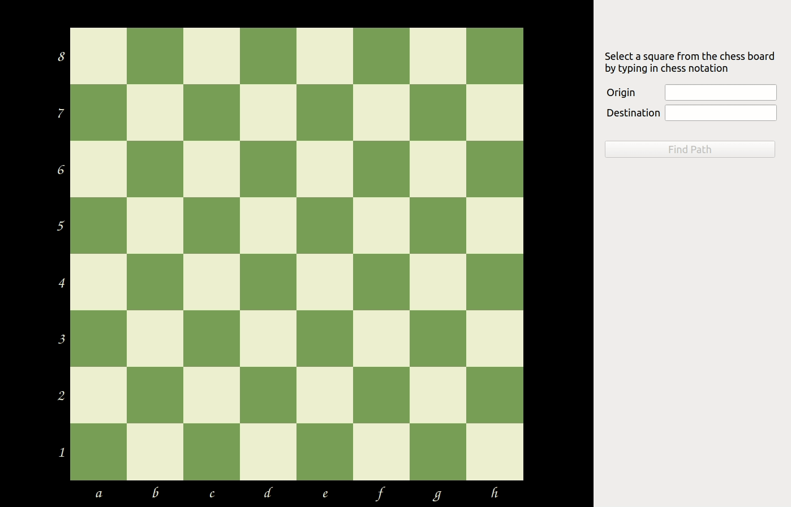
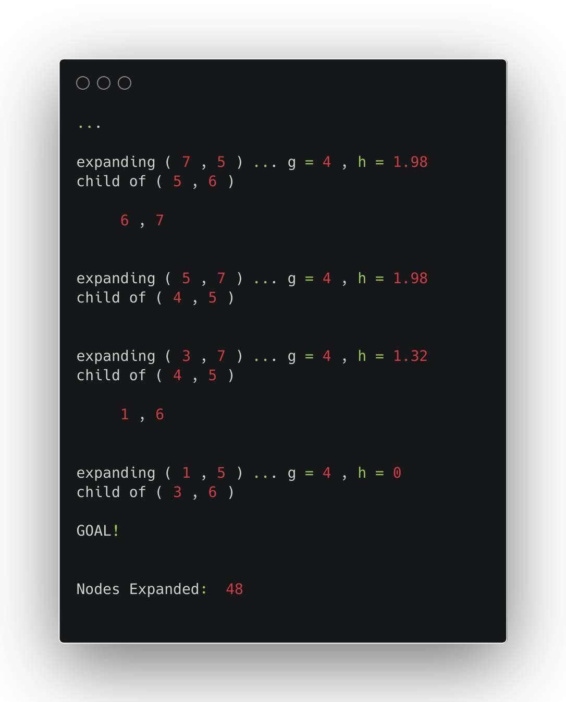

# Knight-Path

  
  
  

    An interactive demonstration tool that traces the shortest path of a knight piece from one tile to another on a chess board.

- Uses `A-Star Search` algorithm inside the hood to find the path with least moves
- Built with QtCreator

## Demo

  

 

## Logs

Dive deep into data with detailed logs to know why this tile was chosen along the route to the destination.
 

## Usage

- Navigate to `File > Open Project` on QtCreator
- Select `knight_path.pro`
- Build and Run to get going
